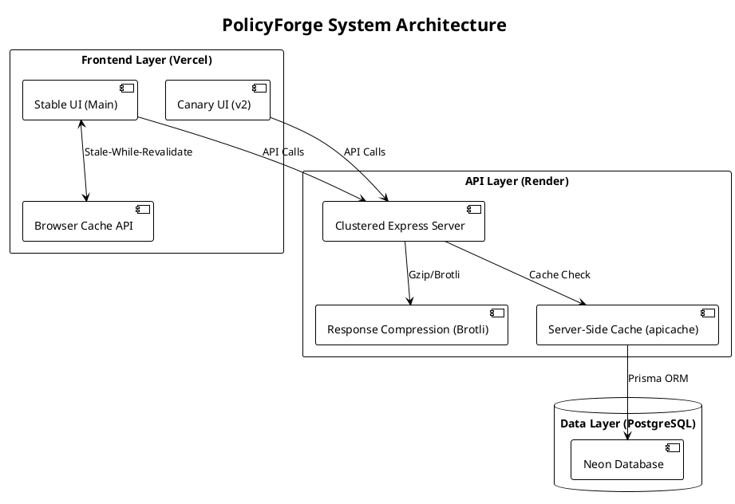

# 🛡️ PolicyForge: High-Performance Student Wellness Intelligence

**PolicyForge** is a clinical-grade student mental health monitoring platform built on the **PERN stack** (PostgreSQL, Express, React, Node.js). It leverages the **PHQ-9 (Patient Health Questionnaire-9)** standard to provide real-time wellness insights.

The platform is engineered for maximum efficiency on free-tier infrastructure, featuring hardware-aware clustering, multi-layer caching (Browser & Server), and aggressive response compression. It follows modern DevOps practices with containerized workflows, automated CI/CD, and a dual-frontend (Stable/Canary) deployment strategy.


## 📋 Table of Contents
- [System Architecture & DevOps](#-system-architecture--devops)
- [🖥️ User Interface (UI) Overview](#️-user-interface-ui-overview)
- [✨ Core Application Features](#-core-application-features)
- [👥 User Roles & Permissions](#-user-roles--permissions)
- [📊 PHQ-9 Scoring System](#-phq-9-scoring-system)
- [🛠️ Tech Stack](#️-tech-stack)
- [📁 Project Structure](#-project-structure)
- [📡 API Documentation](#-api-documentation)
- [🚀 Local Docker Setup](#-local-docker-setup)
- [🌐 Production Deployment Guide](#-production-deployment-guide)

---

## 🏗️ System Architecture & DevOps

The PolicyForge architecture is designed for high availability and low latency, utilizing a distributed setup across Vercel and Render.

### System Architecture Diagram (Report Friendly)



### Infrastructure Key Features:

* **Performance Optimization**: 
    * **Clustering**: Hardware-aware Node.js clustering to maximize CPU utilization.
    * **Compression**: Gzip and Brotli middleware for reduced network payloads.
    * **Caching**: Dual-layer caching strategy:
        * *Server-side*: 30s TTL on hot API routes using `apicache`.
        * *Client-side*: Stale-While-Revalidate pattern using Browser Cache API.
* **Database Migration**: Transitioned from MongoDB to **PostgreSQL** using **Prisma ORM** for type-safe database queries and automated schema migrations.
* **Containerization**: Both the backend API and frontend UIs are fully Dockerized and published to **GHCR**.
* **Deployment Strategy**: 
    * **Stable**: Tracks `main`, production-ready.
    * **Canary**: Tracks `v2`, for testing new features (e.g., modern glassmorphism UI).
* **Reverse Proxying**: Nginx routes traffic locally between Stable, Canary, and Backend services.

---

## 🖥️ User Interface (UI) Overview

The frontend is built with React 18 and Tailwind CSS, focusing on a clean, professional, and accessible user experience.

### 1. Authentication Portal
* **Login Page**: Clean interface with immediate role-based redirection. Includes demo credential buttons for quick evaluator access.
* **Responsive Design**: Fully mobile-optimized for students accessing assessments via smartphones.

### 2. Admin Dashboard (Counselors/Faculty)
* **Statistics Overview**: Top-level metric cards showing Total Students, Critical Cases, Moderate Cases, and Healthy Students.
* **Data Visualization**: 
  * Risk distribution pie charts (built with Recharts).
  * Course-wise and gender-wise statistics bar charts.
* **Student Directory**: A searchable, filterable data table displaying all students.
* **Student Management UI**: Slide-out panels or modals for adding new students and editing demographics with real-time form validation.

### 3. Student Dashboard
* **Status Display**: A large, color-coded risk score indicator showing current mental health status.
* **Assessment History**: A chronological timeline of past PHQ-9 scores.
* **Motivational Hub**: Dynamic motivational messaging and recommendations based on the student's latest score.
* **Crisis Resources**: Persistent, easy-to-access emergency hotline information.

### 4. PHQ-9 Assessment Flow
* **Interactive Questionnaire**: A multi-step form with a progress bar.
* **Real-time Processing**: Radio button selections for the 9 clinical questions with instant score calculation upon submission.
* **Optional Notes**: A secure text field for students to add context to their assessment.

---

## ✨ Core Application Features

* **Multi-Domain Wellness Intelligence**: Monitors five critical pillars of campus life:
    * 🧠 **Mental Wellness**: Emotional health and clinical stress monitoring (PHQ-9).
    * 📚 **Academic Pulse**: Tracking workload pressure, exam anxiety, and attendance stress.
    * 🏠 **Campus Living**: Real-time satisfaction tracking for hostel and mess facilities.
    * 💼 **Career Readiness**: Monitoring placement anxiety and technical preparedness.
    * ⚡ **Lifestyle Balance**: Tracking physical activity and social connectivity.
* **Automatic Risk Engine**: Intelligent mapping of multi-domain responses to unified wellness tiers (Excellent to Critical).
* **Real-Time Intervention Alerts**: Instant flagging of high-priority cases across any domain for counselor review.
* **Support Lifecycle Management**: Integrated ticketing system for students to request help anonymously or via their profile.
* **Historical Wellness Insights**: Longitudinal data tracking to identify student well-being trends over semesters.

---

## 👥 User Roles & Permissions

Strict isolation is maintained via JWT middleware to ensure HIPAA/FERPA compliance standards.

| Capability | Admin (Counselor) | Student |
| :--- | :---: | :---: |
| **View All Students** | ✅ | ❌ |
| **View Own Profile/History** | ✅ | ✅ |
| **Add/Delete Students** | ✅ | ❌ |
| **Edit Demographics** | ✅ | ❌ |
| **Edit PHQ-9 Responses** | ❌ | ❌ (Immutable) |
| **Take PHQ-9 Assessment** | ❌ | ✅ |
| **View Global Analytics** | ✅ | ❌ |

---

## 📊 PHQ-9 Scoring System

### Question Format
Each of the 9 questions has 4 frequency options:
* **Not at all** = 0 points
* **Several days** = 1 point
* **More than half the days** = 2 points
* **Nearly every day** = 3 points

### Clinical Risk Calculation

| Raw Score (0-27) | Risk Score | Clinical Label | UI Color | Recommended Action |
| :--- | :---: | :--- | :--- | :--- |
| **0-4** | 0 | Minimal Depression | 🟢 Green | Maintain healthy habits |
| **5-9** | 1 | Mild Depression | 🟡 Yellow | Stress management |
| **10-14** | 2 | Moderate Depression | 🟠 Orange | Counseling suggested |
| **15-27** | 3 | Severe Depression | 🔴 Red | Immediate support required |

---

## 🛠️ Tech Stack

### Infrastructure & DevOps
- **Docker & Docker Compose** - Containerization
- **GitHub Actions & GHCR** - CI/CD Pipelines
- **Nginx** - Reverse proxy
- **Vercel** - Frontend Production Hosting
- **Render** - Backend API Production Hosting

### Backend (PERN)
- **Node.js & Express.js** - API Framework
- **PostgreSQL** - Relational Database
- **Prisma** - ORM & Migrations
- **JWT & Bcrypt** - Authentication

### Frontend
- **React 18 & Vite** - UI library and build tool
- **React Router v6** - SPA Routing
- **Tailwind CSS** - Utility styling
- **Recharts** - Data visualization

---

## 📁 Project Structure

```text
PolicyForge/
├── .github/workflows/        # CI/CD GitHub Actions (main.yml, v2.yml)
├── backend/                  # Express.js API
│   ├── prisma/               # Schema, Migrations, and Seed scripts
│   ├── controllers/          # Business logic
│   ├── routes/               # API endpoints
│   ├── middleware/           # Auth & Error handling
│   ├── Dockerfile            # Backend container instructions
│   └── server.js             # Entry point
├── frontend/                 # React + Vite
│   ├── src/
│   │   ├── components/       # Reusable UI parts
│   │   ├── pages/            # Admin/Student Dashboards
│   │   └── services/         # Axios API clients
│   ├── Dockerfile            # Frontend container instructions
│   └── vite.config.js        
├── infra/nginx/              # Local Reverse Proxy config
│   └── nginx.conf            
├── docker-compose.yml        # Local orchestration
└── README.md

```

---

## 📡 API Documentation

**Authentication Required:** `Authorization: Bearer <token>`

| Method | Endpoint | Description | Access |
| --- | --- | --- | --- |
| `POST` | `/api/auth/login` | Authenticate user | Public |
| `GET` | `/api/dashboard/stats` | Global metrics | Admin |
| `GET` | `/api/students` | List all students | Admin |
| `POST` | `/api/assessments` | Submit PHQ-9 | Student |
| `GET` | `/api/assessments/my-history` | View own records | Student |

---

## 🚀 Local Docker Setup

Run the entire architecture (DB, API, Stable UI, Canary UI, Nginx) locally.

```bash
# 1. Clone repository
git clone [https://github.com/Amritray01/PolicyForge.git](https://github.com/Amritray01/PolicyForge.git)
cd PolicyForge

# 2. Configure Environment
cp .env.example .env
# Set DB_PASSWORD and JWT_SECRET in .env

# 3. Spin up the cluster
docker-compose up -d --build

# 4. Migrate & Seed Database
docker-compose exec backend-stable npx prisma migrate dev
docker-compose exec backend-stable npx prisma db seed

```

**Access Points:**

* **Stable UI**: `http://localhost/`
* **Canary UI**: `http://localhost/v2/`
* **Backend API**: `http://localhost/api/`

---

## 🌐 Production Deployment Guide

The application utilizes a split-hosting strategy for maximum free-tier efficiency.

### 1. Database (Aiven or Supabase)

* Provision a managed PostgreSQL instance.
* Retrieve the standard connection string.

### 2. Backend API (Render)

* Connect your GitHub repo to a Render Web Service.
* **Environment Variables**: Set `DATABASE_URL`.
* **Start Command**: `npx prisma db push --accept-data-loss && npx prisma db seed && node server.js`

### 3. Frontend UIs (Vercel)

* **PolicyForge Stable**: Create a Vercel project linked to the `main` branch.
* **PolicyForge Canary**: Create a second Vercel project linked to the `v2` branch.
* **Environment Variables**: In both projects, set `VITE_API_URL` to your Render backend URL.
* *Note: Canary uses a `vercel.json` rewrite configuration for SPA routing.*

---

## 🤝 Contributing

Contributions, issues, and feature requests are welcome! Feel free to check the [issues page](https://www.google.com/search?q=https://github.com/Amritray01/PolicyForge/issues).

## 📄 License

This project is licensed under the MIT License - see the LICENSE file for details.

```

```
