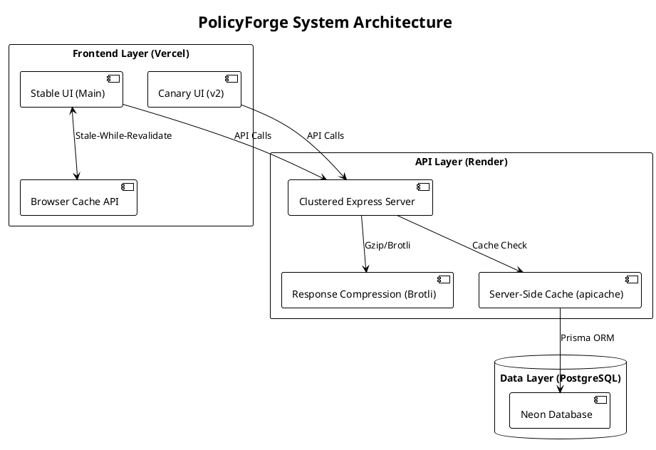

# 🛡️ PolicyForge: Student Wellness Intelligence Platform

**PolicyForge** is a multi-dimensional **Student Wellness Intelligence Platform** built on the **PERN stack** (PostgreSQL, Express, React, Node.js). It is designed to move beyond single-metric depression monitoring into a campus-ready system covering:

* Mental wellness
* Academic stress
* Hostel/mess satisfaction
* Placement readiness stress
* Lifestyle & engagement wellness

**Current implementation (Level 1)** retains the existing architecture and uses **PHQ-9 (Patient Health Questionnaire-9)** as the initial *Mental Wellness* questionnaire, while the UI and terminology are presented through a unified **Student Wellness Index (SWI)** and status badges.

The platform is engineered for maximum efficiency on free-tier infrastructure, featuring hardware-aware clustering, multi-layer caching (Browser & Server), and aggressive response compression. It follows modern DevOps practices with containerized workflows, automated CI/CD, and a dual-frontend (Stable/Canary) deployment strategy.


## 📋 Table of Contents
- [System Architecture & DevOps](#-system-architecture--devops)
- [🖥️ User Interface (UI) Overview](#️-user-interface-ui-overview)
- [✨ Core Application Features](#-core-application-features)
- [👥 User Roles & Permissions](#-user-roles--permissions)
- [📊 Student Wellness Index (Scoring Model)](#-student-wellness-index-scoring-model)
- [🛠️ Tech Stack](#️-tech-stack)
- [📁 Project Structure](#-project-structure)
- [📡 API Documentation](#-api-documentation)
- [🚀 Local Docker Setup](#-local-docker-setup)
- [🌐 Production Deployment Guide](#-production-deployment-guide)

---

## 🏗️ System Architecture & DevOps

The PolicyForge architecture is designed for high availability and low latency, utilizing a distributed setup across Vercel and Render.

### System Architecture Diagram (Report Friendly)



### Infrastructure Key Features:

* **Performance Optimization**: 
    * **Clustering**: Hardware-aware Node.js clustering to maximize CPU utilization.
    * **Compression**: Gzip and Brotli middleware for reduced network payloads.
    * **Caching**: Dual-layer caching strategy:
        * *Server-side*: 30s TTL on hot API routes using `apicache`.
        * *Client-side*: Stale-While-Revalidate pattern using Browser Cache API.
* **Database Migration**: Transitioned from MongoDB to **PostgreSQL** using **Prisma ORM** for type-safe database queries and automated schema migrations.
* **Containerization**: Both the backend API and frontend UIs are fully Dockerized and published to **GHCR**.
* **Deployment Strategy**: 
    * **Stable**: Tracks `main`, production-ready.
    * **Canary**: Tracks `v2`, for testing new features (e.g., modern glassmorphism UI).
* **Reverse Proxying**: Nginx routes traffic locally between Stable, Canary, and Backend services.

---

## 🖥️ User Interface (UI) Overview

The frontend is built with React 18 and Tailwind CSS, focusing on a clean, professional, and accessible user experience.

### 1. Authentication Portal
* **Login Page**: Clean interface with immediate role-based redirection. Includes demo credential buttons for quick evaluator access.
* **Responsive Design**: Fully mobile-optimized for students accessing assessments via smartphones.

### 2. Admin Dashboard (Counselors/Faculty)
* **Statistics Overview**: Top-level metric cards showing Total Students, **High Priority Students**, Moderate Cases, and Healthy Students.
* **Data Visualization**: 
  * Risk distribution pie charts (built with Recharts).
  * Course-wise and gender-wise statistics bar charts.
* **Student Directory**: A searchable, filterable data table displaying all students.
* **Student Management UI**: Slide-out panels or modals for adding new students and editing demographics with real-time form validation.

### 3. Student Dashboard
* **Status Display**: A large, color-coded **Student Wellness Index (SWI)** indicator showing current wellness status.
* **Assessment History**: A chronological timeline of past self-assessment scores.
* **Motivational Hub**: Dynamic motivational messaging and recommendations based on the student's latest score.
* **Crisis Resources**: Persistent, easy-to-access emergency hotline information.

### 4. Wellness Self Assessment Flow
* **Interactive Questionnaire**: A multi-step form with a progress bar.
* **Real-time Processing**: Radio-button selections with instant score calculation upon submission.
* **Optional Notes**: A secure text field for students to add context to their self-assessment.

Note: In **Level 1**, the self-assessment corresponds to the **PHQ-9 Mental Wellness** questionnaire. Levels 2–4 extend the same flow to multiple campus-focused sections without changing the overall UX structure.

---

## ✨ Core Application Features

### Core idea
PolicyForge is positioned as a **campus intelligence platform** that summarizes student wellbeing across multiple dimensions through a single **Student Wellness Index (0–100)** and an easy-to-scan status badge.

### Implementation levels (product roadmap)

#### Level 1 — Rebranding & minimal changes (high priority)
Goal: significantly improve novelty/reviewer perception with **near-zero architecture change**.

Changes:
* Terminology updates:
    * **“Mental Health Risk” → “Student Wellness Index”**
    * **“PHQ-9 Assessment” → “Wellness Self Assessment”**
    * **“Critical Cases” → “High Priority Students”**
* Preserve: existing charts, dashboards, auth, routes, and Prisma schema structure.
* UI/UX: keep the same layout/cards/charts/tables; update labels/descriptions.
* Add UI outputs: **Overall Wellness Score (0–100)** + **Wellness Status badge**.

#### Level 2 — Multi-domain wellness modules (recommended)
Goal: extend beyond PHQ-9 using lightweight, campus-focused questionnaires.

New sections:
1. Mental Wellness
2. Academic Stress
3. Hostel & Mess Satisfaction
4. Placement Readiness
5. Lifestyle & Social Wellness

Implementation approach:
* Add assessment sections/tabs.
* Reuse existing multi-step form UI, progress bar, and radio-button logic.
* Store: `assessmentType`, per-section score, and `finalWellnessScore` (minimal Prisma extension; reuse existing assessment architecture).

#### Level 3 — Smart analytics & insights (high value)
Goal: evolve into a **Campus Intelligence Platform** using rule-based insights and existing chart components.

Examples:
* Course-wise stress distribution
* Hostel dissatisfaction trends
* Placement anxiety trends
* Academic burnout indicators
* Wellness trends over semesters

Dashboard additions (reusing Recharts + analytics cards):
* Top Risk Factors
* Most Affected Departments
* Hostel Satisfaction Trends
* Placement Readiness Overview

#### Level 4 — Support & intervention module (optional)
Goal: add actionable support workflows.

Features:
* Anonymous support requests
* Counseling requests
* Placement mentoring requests
* Hostel complaint escalation
* Faculty support tickets

Admin panel:
* Pending requests, priority, status tracking, escalation indicators

---

## 👥 User Roles & Permissions

Strict isolation is maintained via JWT middleware to support strong privacy and role separation.

| Capability | Admin (Counselor) | Student |
| :--- | :---: | :---: |
| **View All Students** | ✅ | ❌ |
| **View Own Profile/History** | ✅ | ✅ |
| **Add/Delete Students** | ✅ | ❌ |
| **Edit Demographics** | ✅ | ❌ |
| **Edit Self-Assessment Responses** | ❌ | ❌ (Immutable) |
| **Take Wellness Self Assessment** | ❌ | ✅ |
| **View Global Analytics** | ✅ | ❌ |

---

## 📊 Student Wellness Index (Scoring Model)

PolicyForge presents student wellbeing through:
* **Student Wellness Index (SWI)**: $0–100$ (higher = higher risk/stress)
* **Wellness Status** badge (Excellent → Critical)

### Level 1 (current): SWI derived from PHQ-9

PHQ-9 remains the underlying questionnaire for the *Mental Wellness* module in the current implementation.

**PHQ-9 question format** (9 questions, 0–3 each):
* **Not at all** = 0
* **Several days** = 1
* **More than half the days** = 2
* **Nearly every day** = 3

**PHQ-9 raw score**: $0–27$.

**UI mapping (recommended for Level 1 rebrand):**
* Convert raw PHQ-9 to a $0–100$ SWI scale (e.g., normalized mapping) so the UI can display a consistent wellness index and badge.

### Level 2+ (recommended): final wellness index across 5 sections

Each section produces a normalized $0–100$ score.

**FinalWellnessScore**:

$$
\mathrm{FinalWellnessScore} =
(\mathrm{Mental} \cdot 0.35) +
(\mathrm{Academic} \cdot 0.25) +
(\mathrm{Hostel} \cdot 0.15) +
(\mathrm{Placement} \cdot 0.15) +
(\mathrm{Lifestyle} \cdot 0.10)
$$

### Wellness status levels (SWI / FinalWellnessScore)

| Score (0–100) | Status |
| :---: | :--- |
| **0–20** | Excellent |
| **21–40** | Stable |
| **41–60** | Needs Attention |
| **61–80** | High Risk |
| **81–100** | Critical |

### Questionnaire sections (Level 2)
These sections are designed to reuse the existing assessment flow UI.

* **Mental Wellness** (0–3): emotional exhaustion, sleep quality, motivation, concentration, isolation
* **Academic Stress** (0–3): assignment pressure, exam fear, backlog anxiety, time management, attendance stress
* **Hostel & Mess Satisfaction** (1–5): food quality, cleanliness, internet reliability, noise levels, safety satisfaction
* **Placement Readiness** (0–3): placement anxiety, technical confidence, resume readiness, interview preparedness, fear of unemployment
* **Lifestyle & Social Wellness** (1–5): physical activity, social interaction, screen-time balance, sleep routine, campus engagement

### Rule-based summary & suggestion engine (Level 3)

PolicyForge’s recommended insight style is **simple rule-based logic** (no heavy ML initially).

Examples:
* High academic stress + high placement stress → “Elevated academic pressure and placement-related anxiety.” → recommend mentoring + placement prep.
* Poor hostel satisfaction + poor sleep indicators → “Living conditions may be affecting wellbeing.” → recommend hostel escalation + wellness support.
* Balanced scores across modules → “Stable wellness indicators with manageable stress.” → recommend routine maintenance + periodic tracking.

---

## 🛠️ Tech Stack

### Infrastructure & DevOps
- **Docker & Docker Compose** - Containerization
- **GitHub Actions & GHCR** - CI/CD Pipelines
- **Nginx** - Reverse proxy
- **Vercel** - Frontend Production Hosting
- **Render** - Backend API Production Hosting

### Backend (PERN)
- **Node.js & Express.js** - API Framework
- **PostgreSQL** - Relational Database
- **Prisma** - ORM & Migrations
- **JWT & Bcrypt** - Authentication

### Frontend
- **React 18 & Vite** - UI library and build tool
- **React Router v6** - SPA Routing
- **Tailwind CSS** - Utility styling
- **Recharts** - Data visualization

---

## 📁 Project Structure

```text
PolicyForge/
├── .github/workflows/        # CI/CD GitHub Actions (main.yml, v2.yml)
├── backend/                  # Express.js API
│   ├── prisma/               # Schema, Migrations, and Seed scripts
│   ├── controllers/          # Business logic
│   ├── routes/               # API endpoints
│   ├── middleware/           # Auth & Error handling
│   ├── Dockerfile            # Backend container instructions
│   └── server.js             # Entry point
├── frontend/                 # React + Vite
│   ├── src/
│   │   ├── components/       # Reusable UI parts
│   │   ├── pages/            # Admin/Student Dashboards
│   │   └── services/         # Axios API clients
│   ├── Dockerfile            # Frontend container instructions
│   └── vite.config.js        
├── infra/nginx/              # Local Reverse Proxy config
│   └── nginx.conf            
├── docker-compose.yml        # Local orchestration
└── README.md

```

---

## 📡 API Documentation

**Authentication Required:** `Authorization: Bearer <token>`

| Method | Endpoint | Description | Access |
| --- | --- | --- | --- |
| `POST` | `/api/auth/login` | Authenticate user | Public |
| `GET` | `/api/dashboard/stats` | Global metrics | Admin |
| `GET` | `/api/students` | List all students | Admin |
| `POST` | `/api/assessments` | Submit Wellness Self Assessment (Level 1: PHQ-9) | Student |
| `GET` | `/api/assessments/my-history` | View own records | Student |

---

## 🚀 Local Docker Setup

Run the entire architecture (DB, API, Stable UI, Canary UI, Nginx) locally.

```bash
# 1. Clone repository
git clone [https://github.com/Amritray01/PolicyForge.git](https://github.com/Amritray01/PolicyForge.git)
cd PolicyForge

# 2. Configure Environment
cp .env.example .env
# Set DB_PASSWORD and JWT_SECRET in .env

# 3. Spin up the cluster
docker-compose up -d --build

# 4. Migrate & Seed Database
docker-compose exec backend-stable npx prisma migrate dev
docker-compose exec backend-stable npx prisma db seed

```

**Access Points:**

* **Stable UI**: `http://localhost/`
* **Canary UI**: `http://localhost/v2/`
* **Backend API**: `http://localhost/api/`

---

## 🌐 Production Deployment Guide

The application utilizes a split-hosting strategy for maximum free-tier efficiency.

### 1. Database (Aiven or Supabase)

* Provision a managed PostgreSQL instance.
* Retrieve the standard connection string.

### 2. Backend API (Render)

* Connect your GitHub repo to a Render Web Service.
* **Environment Variables**: Set `DATABASE_URL`.
* **Start Command**: `npx prisma db push --accept-data-loss && npx prisma db seed && node server.js`

### 3. Frontend UIs (Vercel)

* **PolicyForge Stable**: Create a Vercel project linked to the `main` branch.
* **PolicyForge Canary**: Create a second Vercel project linked to the `v2` branch.
* **Environment Variables**: In both projects, set `VITE_API_URL` to your Render backend URL.
* *Note: Canary uses a `vercel.json` rewrite configuration for SPA routing.*

---

## 🤝 Contributing

Contributions, issues, and feature requests are welcome! Feel free to check the [issues page](https://www.google.com/search?q=https://github.com/Amritray01/PolicyForge/issues).

## 📄 License

This project is licensed under the MIT License - see the LICENSE file for details.
